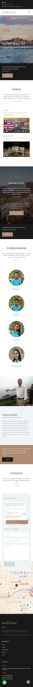
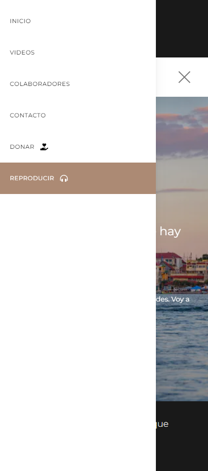

<h3 align="center">
   <a href="https://radiosulamita.org/" >
 Project site
  </a>
</h3>

## 📦 Packages

- ⚡️ [Next.js](https://nextjs.org/) - The React Framework for Production.
- ⚛️ [React.js](https://reactjs.org/) - A JavaScript library for building user interfaces.
- 💙 [TypeScript](https://www.typescriptlang.org/) - A superset of JavaScript.
- 🍃 [TailwindCSS](https://tailwindcss.com/) - A utility-first CSS framework for rapidly building custom user interfaces.
- 🔥 [Firebase](https://firebase.google.com) - A platform developed by Google for creating mobile and web applications.
- 📝 [Formik](https://formik.org/) - The world's most popular open source form library for React.
- 🌐 [Redux](https://redux.js.org/) - An open-source JavaScript library for managing and centralizing application state.
- 🔃 [Axios](https://axios-http.com/) - Promise based HTTP client for the browser and Node.js.
- 📹 [Plyr](https://www.npmjs.com/package/plyr-react) - A responsive media player that is simple, easy to use, and customizable for video, audio, YouTube, and Vimeo.

## 🚀 Getting started

You need:

- [Node.js 16+](https://nodejs.org/en/)
- [Yarn](https://yarnpkg.com/)
- [Git](https://git-scm.com/book/en/v2/Getting-Started-Installing-Git)

1. Clone the repository:

```bash
$ gh repo clone carlos-dubon/radio-sulamita
```

2. Install the dependencies:

```bash
$ yarn install
```

3. Run:

```bash
$ yarn dev
```

## 📸 Screenshots





## ☀️ License

[MIT](./LICENSE)
